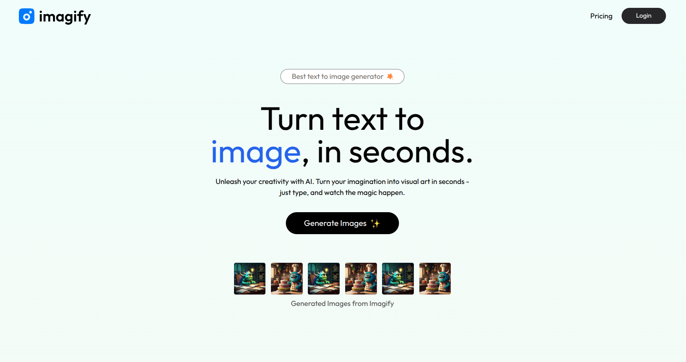

# Imagify-Backend

This is the backend for a full-stack **AI-powered text-to-image generator SaaS application**, built using **Node.js, Express.js, and MongoDB**.

## 🚀 Features

- 🛠️ **RESTful API** - Handles authentication, image generation, and payments.
- 🔐 **JWT Authentication** - Secure user login and session management.
- 🎨 **AI Image Generation** - Convert text prompts into AI-generated images.
- 📦 **Credit-based System** - Users can purchase credits to generate images.
- 💳 **Payment Integration** - Razorpay integration for secure transactions.
- 📡 **MongoDB Database** - Stores user details, transactions, and generated images.

## 🌍 Live Demo  

🔗 **Live Link:** [Click Here](https://imagify-ai-saas.vercel.app/)  

🔗 **Frontend Repository:** [Frontend repo](https://github.com/sudo-dpkg/imagify)   

## 🛠️ Tech Stack

- **Node.js** - JavaScript runtime environment
- **Express.js** - Web framework for building API routes
- **MongoDB & Mongoose** - NoSQL database and ORM
- **JWT (JSON Web Tokens)** - Secure user authentication
- **Razorpay SDK** - Payment gateway integration
- **Cron Jobs** - Automating tasks Scheduling

## 📡 API Endpoints  

### 🔐 **User Authentication**  
| Method | Endpoint            | Description               |
|--------|---------------------|---------------------------|
| `POST` | `/api/user/register`  | Register a new user       |
| `POST` | `/api/user/login`   | Login user      |

### 🖼️ **AI Image Generation**  
| Method | Endpoint        | Description                |
|--------|----------------|----------------------------|
| `POST` | `/api/image/generate-image` | Generate an image from text |

### 💳 **Payments & Credits**  
| Method | Endpoint         | Description                |
|--------|-----------------|----------------------------|
| `POST` | `/api/user/pay-razor`   | Handle credit purchases    |
| `GET`  | `/api/user/credits`   | Fetch user credits |

---

## 🏗️ Project Structure  

```bash
/imagify

│── /models           # Database models
│── /routes           # API routes
│── /controllers      # API handling
│── /middlewares      # Authentication and validation
│── /config           # DB connections, Cron Job
│── server.js         # Entry point of the backend
│── package.json      # Dependencies and scripts
```

## 📷 Preview

